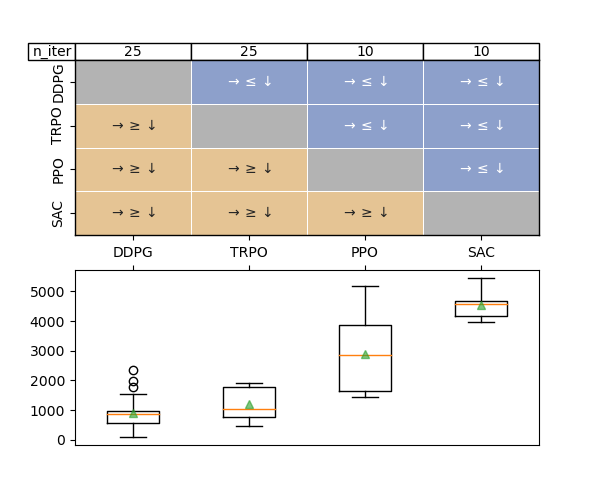

# AdaStop
Sequential testing for efficient and reliable comparison of stochastic algorithms.

This package contains the AdaStop algorithm. AdaStop implements a *statistical test to adaptively choose the number of runs of stochastic algorithms* necessary to compare these algorithms and be able to rank them with a theoretically controlled family-wise error rate. One particular application for which AdaStop was created is to compare Reinforcement Learning algorithms. Please note, that what we call here *algorithm* is really *a certain implementation of an algorithm*.

The test proceed in stages (or interims). First we collect $n$ performance measures for all $L$ algorithms computed on $n\times L$ different random seeds.
Then, Adastop examines these $n\times L$ numbers and decides that some of the algorithms are different, some of them are equal, and some of them needs more data to be distinguished. The process then reapeats until a decision have been reached on all the algorithms.

The parameters of Adastop are described below, most important are $n$ the number of evaluations at each interim and $K$ the maximum number of interims.

# Installation

To install adastop, use pip: from the root of adastop directory,
```
pip install --user .
```

This will automatically install the command line interface as well as the python library.

# Usage

There are two ways to use this package:

- Command line interface: AdaStop can be used as a command line interface that takes csv files as input. The cli interface can either be called interactively or the process can be automated using bash script.
- Python API: AdaStop is coded in python and can directly be imported as a module to be used in a python script.

## CLI usage

The command line interface takes csv files as input. Each csv file must contain a dataframe with $n$ rows and as many columns as there are algorithms. Each of the $n$ rows corresponds to one run of an algorithm.
Please note that if, in the process of the algorithm, all the comparisons for one of the algorithm are decided, then this algorithm does not need to be run anymore and the number of columns in the next csv file would decrease.

Below, we give an example based on files containing the evaluations of PPO,DDPG,SAC,TRPO, four Deep Reinforcement Learning algorithmes, given in the `examples` directory.

The AdaStop algorithm is initialized with the first test done through `adastop compare` and the current state of AdaStop is then saved in a pickle file:

```console
> adastop
Usage: adastop [OPTIONS] COMMAND [ARGS]...

  Program to perform adaptive stopping algorithm using csv file intput_file.

  Use adastop sub-command --help to have help for a specific sub-command

Options:
  --help  Show this message and exit.

Commands:
  compare  Perform one step of adaptive stopping algorithm using csv file...
  plot     Plot results of the comparator situated in the folder 'folder'.
  reset    Reset the comparator to zero by removing the save file of the...

> adastop compare --help
Usage: adastop compare [OPTIONS] INPUT_FILE

  Perform one step of adaptive stopping algorithm using csv file intput_file.
  At first call, the comparator will be initialized with the arguments passed
  and then it will be saved to a save file in `.adastop_comparator.pkl`.

Options:
  --n-groups INTEGER        Number of groups.  [default: 5]
  --n-permutations INTEGER  Number of random permutations.  [default: 10000]
  --alpha FLOAT             Type I error.  [default: 0.05]
  --beta FLOAT              early accept parameter.  [default: 0]
  --compare-to-first        Compare all algorithms to the first algorithm.
  --help                    Show this message and exit.

> cat examples/walker1.csv # file contains evaluations on walker environment
,PPO,DDPG,SAC,TRPO
0,3683.49072265625,420.27471923828125,4291.02978515625,446.09295654296875
1,1576.483154296875,640.0671997070312,4551.0380859375,1918.919677734375
2,3908.14013671875,2338.0419921875,4669.77490234375,1015.7262573242188
3,1451.9110107421875,879.0955200195312,4697.365234375,757.0098876953125
4,5177.005859375,736.5420532226562,4074.497802734375,1769.3448486328125

> adastop reset . # reset the state of the comparator (remove hidden pickle file)
Comparator file have been removed.
> adastop compare --n-groups 5 --beta 0.01 --seed 42 walker1.csv 
Still undecided about DDPG PPO SAC TRPO

Comparator Saved
```
After this first step, it is still undecided what is the ranking of DDPG and TRPO  (e.g. the "continue" decisions). We have to generate new runs for all the algorithms in order to have more information and be able to rank these algorithms. Once these runs are generated, we continue the process.

```console
> adastop compare --n-groups 5 --beta 0.01 --seed 42 walker2.csv
Still undecided about DDPG TRPO

Comparator Saved

> adastop compare --n-groups 5 --beta 0.01 --seed 42 walker3.csv
Still undecided about DDPG TRPO

Comparator Saved

> adastop compare --n-groups 5 --beta 0.01 --seed 42 walker4.csv
Still undecided about DDPG TRPO

Comparator Saved

> adastop compare --n-groups 5 --beta 0.01 --seed 42 walker5.csv

Test is finished, decisions are

Decision between PPO and DDPG is: larger
Decision between PPO and SAC is: smaller
Decision between PPO and TRPO is: larger
Decision between DDPG and SAC is: smaller
Decision between DDPG and TRPO is: smaller
Decision between SAC and TRPO is: larger

Comparator Saved
```
The processed stops and we can plot the resulting decisions.



If one wants to reset AdaStop to redo the process, one can use `adastop reset examples`.

## Python API:

To use the python API, one only needs to define a function named `train_evaluate(agent, n)` which trains `n` copies of `agent` and returns `n` evaluation values.

```python
from adastop import MultipleAgentsComparator

comparator = MultipleAgentsComparator(n=6, K=6, B=10000, alpha=0.05)

eval_values = {agent.name: [] for agent in agents}

for k in range(comparator.K):
    for  agent in enumerate(agents):
       # If the agent is still in one of the comparison considered, then generate new evaluations.
       if agent in comparator.current_comparisons.ravel():
           eval_values[agent.name].append(train_evaluate(agent, n))
   decisions, T = comparator.partial_compare(eval_values, verbose)
   if comparator.is_finished:
       break
```

## The compare_agents module

### _class_ compare_agents.MultipleAgentsComparator(n=5, K=5, B=10000, comparisons=None, alpha=0.01, beta=0, seed=None, joblib_backend='threading')
Bases: `object`

Compare sequentially agents, with possible early stopping.
At maximum, there can be n times K fits done.

#### Parameters

n: int, default=5

    number of fits before each early stopping check

K: int, default=5

    number of check

B: int, default=None

    Number of random permutations used to approximate permutation distribution.

comparisons: list of tuple of indices or None

    if None, all the pairwise comparison are done.
    If = [(0,1), (0,2)] for instance, the compare only 0 vs 1  and 0 vs 2

alpha: float, default=0.01

    level of the test

beta: float, default=0

    power spent in early accept.

seed: int or None, default = None

joblib_backend: str, default = “threading”

    backend to use to parallelize on multi-agents. Use “multiprocessing” or “loky” for a true parallelization.

#### Attributes

agent_names: list of str

    list of the agents’ names.

decision: dict

    decision of the tests for each comparison, keys are the comparisons and values are in {“equal”, “larger”, “smaller”}.

n_iters: dict

    number of iterations (i.e. number of fits) used for each agent. Keys are the agents’ names and values are ints.


